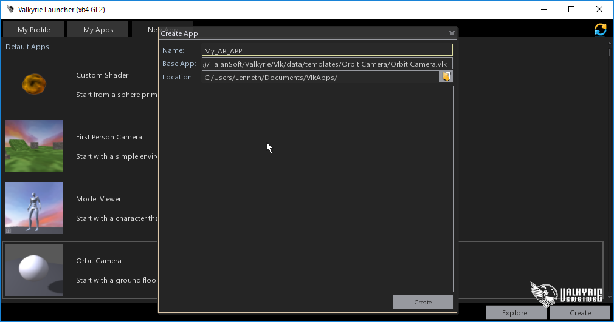
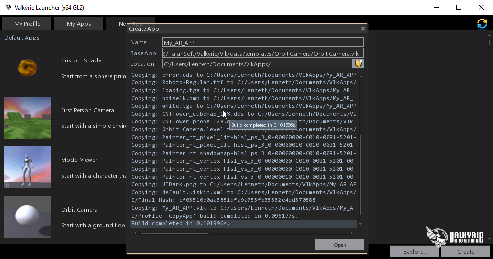
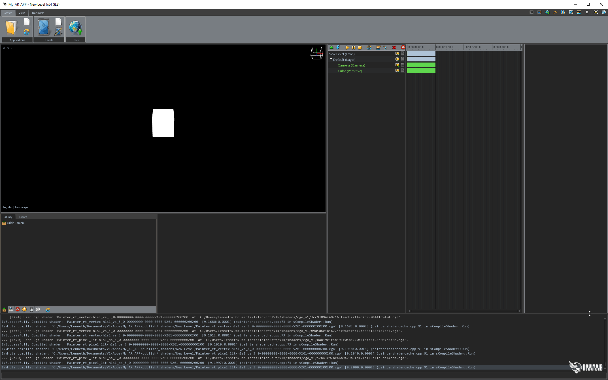
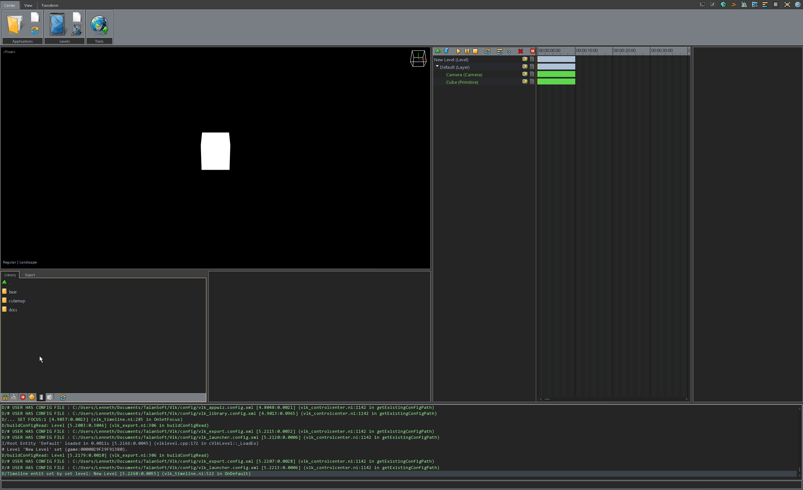

- [Step 1: Prepare your assets](#step-1)
- [Step 2: Create a Valkyrie scene](#step-2)

#  Step 1: Prepare your assets

After designing your assets with your preferred 3D modelling suite, export them in one of following formats:

FBX or DAE for animated & static assets.
OBJ is also an option for static assets.
JPG, PNG or TGA for textures (It is recommended to set a maximum texture resolution of 2048x2048px).

#  Step 2: Create a Valkyrie scene

- Open the Valkyrie Launcher & click on the New App tab.

- Select the template of your choice & click on create button located at the bottom-right corner.

- You will be prompted to select a name for your application.

- Take note that the folder used for your application is displayed in the location tab. By default its in your document's folder `Vlk Projects/Project Name`.

- Confirm the creation of your application by clicking on the Create button.

- Upon creating your application, your Valkyrie Scene will be launched automatically, and you will be greeted with a blank level.

- To load the level from the template you selected earlier, click on the Application Levels tab.

- If you save your scene using `CTRL+S` the changes made to the level you are working on will be saved without creating a new level.

- You have also the possibility to save your scene incrementally using `Cmd+Shift+S / CTRL+SHIFT+S`. A new level will then be created.
